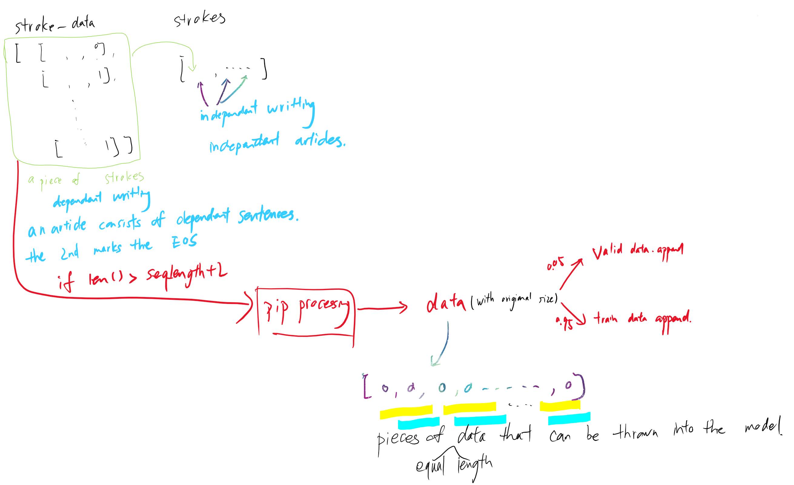
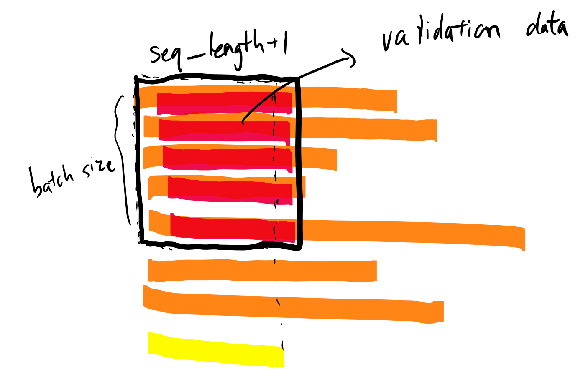
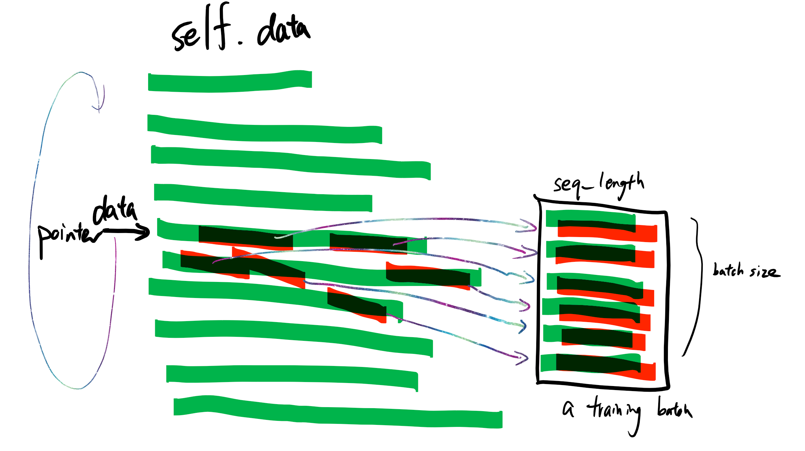

# Generative Handwriting Demo using TensorFlow

## reference
See this blog post at [blog.otoro.net](http://blog.otoro.net/2015/12/12/handwriting-generation-demo-in-tensorflow) for more information.

## theory
An attempt to implement the random handwriting generation portion of Alex Graves' [paper](http://arxiv.org/abs/1308.0850).


## data
batch_size=50, seq_length=300

训练数据和验证数据就是错开了一个时刻,这和训练language model是一样的:
```
x_batch.append(np.copy(data[idx:idx+self.seq_length]))
y_batch.append(np.copy(data[idx+1:idx+self.seq_length+1]))
```


取validation data(仅取一个batch)


取训练时的batch

`self.pointer`用来标记取sequence作为训练数据的指针. 这个指针在当前sequence data中取完一个长度为`seq_length`的sequence作为batch中的一个后, 指针可能是指向下一个sequence data, 也可能原地不动, 原地概率与sequence data的长度成正比. 当指针指到sequence data底时,返回第一个.

## Model
模型分两种状态: 一个是训练状态,一个是采样状态(训练状态`infer =False`).
使用多层LSTM作为RNN的cell
## Train
模型的输出需要经过非线性映射才能得到合法的参数:
```
o_pi, o_mu1, o_mu2, o_sigma1, o_sigma2, o_corr, o_eos =
    get_mixture_coef(output)
```
因为模型输出是分布/分布参数, 不能直接与target比较,需要对分布进行采样后才能进行比较:
```
lossfunc = get_lossfunc(o_pi, o_mu1, o_mu2, o_sigma1, o_sigma2, o_corr, o_eos, x1_data, x2_data, eos_data)
```

You will need permission from [these wonderful people](http://www.iam.unibe.ch/fki/databases/iam-on-line-handwriting-database) people to get the IAM On-Line Handwriting data.  Unzip `lineStrokes-all.tar.gz` into the data subdirectory, so that you end up with `data/lineStrokes/a01`, `data/lineStrokes/a02`, etc.  Afterwards, running `python train.py` will start the training process.

A number of flags can be set for training if you wish to experiment with the parameters.  The default values are in `train.py`

## Sample
采样时, model的batch参数设为1(只生成一个sequence), seq_length也设为1(因为下一时刻的输入得靠当前时刻的输出采样作为输入, 没办法预先提供给model)

### IPython interactive session.

If you wish to experiment with this code interactively, just run `%run -i sample.py` in an IPython console, and then the following code is an example on how to generate samples and show them inside IPython.

```
[strokes, params] = model.sample(sess, 800)
draw_strokes(strokes, factor=8, svg_filename = 'sample.normal.svg')
draw_strokes_random_color(strokes, factor=8, svg_filename = 'sample.color.svg')
draw_strokes_random_color(strokes, factor=8, per_stroke_mode = False, svg_filename = 'sample.multi_color.svg')
draw_strokes_eos_weighted(strokes, params, factor=8, svg_filename = 'sample.eos.svg')
draw_strokes_pdf(strokes, params, factor=8, svg_filename = 'sample.pdf.svg')

```
